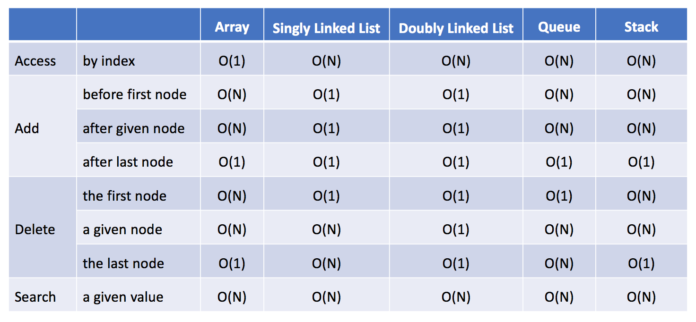

复习
让我们简要回顾一下单链表和双链表的表现。

它们在许多操作中是相似的。

它们都无法在常量时间内随机访问数据。
它们都能够在 O(1) 时间内在给定结点之后或列表开头添加一个新结点。
它们都能够在 O(1) 时间内删除第一个结点。
但是删除给定结点(包括最后一个结点)时略有不同。

在单链表中，它无法获取给定结点的前一个结点，因此在删除给定结点之前我们必须花费 O(N) 时间来找出前一结点。
在双链表中，这会更容易，因为我们可以使用“prev”引用字段获取前一个结点。因此我们可以在 O(1) 时间内删除给定结点。

对照
这里我们提供链表和其他数据结构（包括数组，队列和栈）之间时间复杂度的比较：

经过这次比较，我们不难得出结论：

如果你需要经常添加或删除结点，链表可能是一个不错的选择。

如果你需要经常按索引访问元素，数组可能是比链表更好的选择。