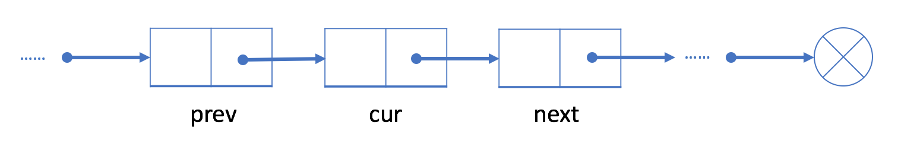

正如我们在概览中提到的那样，链表是一种线性数据结构，它通过引用字段将所有分离的元素链接在一起。有两种常用的链表：单链表和双链表。

本章节中，我们将从单链表开始，并帮助您：

了解单链表的结构；
在单链表中执行遍历，插入和删除操作；
分析单链表中不同操作的时间复杂度。

结点结构

在大多数情况下，我们将使用头结点(第一个结点)来表示整个列表。

操作
与数组不同，我们无法在常量时间内访问单链表中的随机元素。 如果我们想要获得第 i 个元素，我们必须从头结点逐个遍历。 我们按索引来访问元素平均要花费 O(N) 时间，其中 N 是链表的长度。

例如，在上面的示例中，头结点是 23。访问第 3 个结点的唯一方法是使用头结点中的“next”字段到达第 2 个结点（结点 6）; 然后使用结点 6 的“next”字段，我们能够访问第 3 个结点。

你可能想知道为什么链表很有用，尽管它在通过索引访问数据时（与数组相比）具有如此糟糕的性能。 在接下来的两篇文章中，我们将介绍插入和删除操作，你将了解到链表的好处。

之后，我们将为你提供练习设计自己的单链表。

========添加操作 - 单链表========

如果我们想在给定的结点 prev 之后添加新值，我们应该：

使用给定值初始化新结点 cur；

将 cur 的 next 字段链接到 prev 的下一个结点 next ；

将 prev 中的 next 字段链接到 cur 。

与数组不同，我们不需要将所有元素移动到插入元素之后。因此，您可以在 O(1) 时间复杂度中将新结点插入到链表中，这非常高效。

**在开头添加结点**

众所周知，我们使用头结点来代表整个列表。

因此，在列表开头添加新节点时更新头结点 head 至关重要。

初始化一个新结点 cur ；
将新结点链接到我们的原始头结点 head。
将 cur 指定为 head 。
例如，让我们在列表的开头添加一个新结点 9 。

我们初始化一个新结点 9 并将其链接到当前头结点 23 。

指定结点 9 为新的头结点。

在链表末尾添加节点，需要从 head 遍历，直到找到最后一个节点，将该节点的next设置为目标节点。

========删除操作 - 单链表========

如果我们想从单链表中删除现有结点 cur，可以分两步完成：

找到 cur 的上一个结点 prev 及其下一个结点 next ；

接下来链接 prev 到 cur 的下一个节点 next 。

在我们的第一步中，我们需要找出 prev 和 next。使用 cur 的参考字段很容易找出 next，但是，我们必须从头结点遍历链表，以找出 prev，它的平均时间是 O(N)，其中 N 是链表的长度。因此，删除结点的时间复杂度将是 O(N)。

空间复杂度为 O(1)，因为我们只需要常量空间来存储指针。

删除第一个结点
如果我们想删除第一个结点，策略会有所不同。

正如之前所提到的，我们使用头结点 head 来表示链表。我们的头是下面示例中的黑色结点 23。

如果想要删除第一个结点，我们可以简单地将下一个结点分配给 head。也就是说，删除之后我们的头将会是结点 6。

链表从头结点开始，因此结点 23 不再在我们的链表中。

面试要点
链表时一个包含零个或多个元素的数据结构。每个元素都包含一个值和到另一个元素的链接。根据链接数的不同，可以分为单链表，双链表和多重链表。

单链表是最简单的一种，它提供了在常数时间内的 addAtHead 操作和在线性时间内的 addAtTail 的操作。双链表是最常用的一种，因为它提供了在常数时间内的 addAtHead 和 addAtTail 操作，并且优化的插入和删除。

双链表在 Java 中的实现为 LinkedList，在 Python 中为 list。这些结构都比较常用，有两个要点：

哨兵节点：
哨兵节点在树和链表中被广泛用作伪头、伪尾等，通常不保存任何数据。

我们将使用伪头来简化我们简化插入和删除。在接下来的两种方法中应用此方法。

双链表的双向搜索：我们可以从头部或尾部进行搜索。

设计链表
设计链表的实现。您可以选择使用单链表或双链表。单链表中的节点应该具有两个属性：val 和 next。val 是当前节点的值，next 是指向下一个节点的指针/引用。如果要使用双向链表，则还需要一个属性 prev 以指示链表中的上一个节点。假设链表中的所有节点都是 0-index 的。

在链表类中实现这些功能：

get(index)：获取链表中第 index 个节点的值。如果索引无效，则返回-1。
addAtHead(val)：在链表的第一个元素之前添加一个值为 val 的节点。插入后，新节点将成为链表的第一个节点。
addAtTail(val)：将值为 val 的节点追加到链表的最后一个元素。
addAtIndex(index,val)：在链表中的第 index 个节点之前添加值为 val  的节点。如果 index 等于链表的长度，则该节点将附加到链表的末尾。如果 index 大于链表长度，则不会插入节点。如果index小于0，则在头部插入节点。
deleteAtIndex(index)：如果索引 index 有效，则删除链表中的第 index 个节点。
 

示例：

MyLinkedList linkedList = new MyLinkedList();
linkedList.addAtHead(1);
linkedList.addAtTail(3);
linkedList.addAtIndex(1,2);   //链表变为1-> 2-> 3
linkedList.get(1);            //返回2
linkedList.deleteAtIndex(1);  //现在链表是1-> 3
linkedList.get(1);            //返回3

反转链表

一种解决方案是按原始顺序迭代结点，并将它们逐个移动到列表的头部。似乎很难理解。我们先用一个例子来说明我们的算法。

算法概述
让我们看一个例子：

请记住，黑色结点 23 是原始的头结点。

1. 首先，我们将黑色结点的下一个结点（即结点 6）移动到列表的头部：

2. 然后，我们将黑色结点的下一个结点（即结点 15）移动到列表的头部：

3. 黑色结点的下一个结点现在是空。因此，我们停止这一过程并返回新的头结点 15。

更多
在该算法中，每个结点只移动一次。

因此，时间复杂度为 O(N)，其中 N 是链表的长度。我们只使用常量级的额外空间，所以空间复杂度为 O(1)。

这个问题是你在面试中可能遇到的许多链表问题的基础。如果你仍然遇到困难，我们的下一篇文章将更多地讨论实现细节。

我们为你提供了几个练习。你可能已经注意到它们之间的相似之处了。这里我们提供一些提示：

 

1. 通过一些测试用例可以节省您的时间。

使用链表时不易调试。因此，在编写代码之前，自己尝试几个不同的示例来验证您的算法总是很有用的。

 

2. 你可以同时使用多个指针。

有时，当你为链表问题设计算法时，可能需要同时跟踪多个结点。您应该记住需要跟踪哪些结点，并且可以自由地使用几个不同的结点指针来同时跟踪这些结点。

如果你使用多个指针，最好为它们指定适当的名称，以防将来必须调试或检查代码。

 

3. 在许多情况下，你需要跟踪当前结点的前一个结点。

你无法追溯单链表中的前一个结点。因此，您不仅要存储当前结点，还要存储前一个结点。这在双链表中是不同的，我们将在后面的章节中介绍。

作者：力扣 (LeetCode)
链接：https://leetcode-cn.com/leetbook/read/linked-list/fraqr/
来源：力扣（LeetCode）
著作权归作者所有。商业转载请联系作者获得授权，非商业转载请注明出处。

